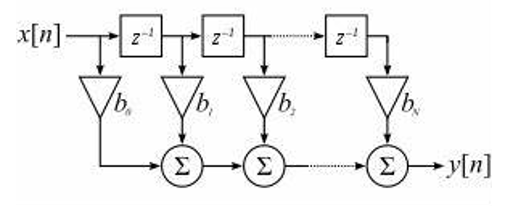
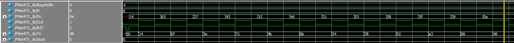

# Weighted Moving Average Filter
A Weighted Moving Average (WMA) filter is being developed using the coefficients ` H = [1 , 0.5 , 0.25 , 0.125]` , which represent the weighting applied to input data points during the averaging process. The filter is implemented in a transposed structure, a common approach in digital filter design.

This type of filter, classified as a Finite Impulse Response (FIR) filter, computes a weighted average over a fixed number of input samples. The predefined weights are applied to both current and past input values to generate the output. The filter operates at a sampling frequency of 100 MHz.


---
## RTL

```
{
  module FilterRTL #(parameter RegWidth = 4)(
	
	input wire [7 : 0] Xn ,
	input wire CLK ,
	input wire RST ,
	
	output wire [7 : 0] Yn
);


reg [7 : 0] Delay  [3 : 0] ;

integer i ; 

always @(posedge CLK or negedge RST)
begin
	if (!RST)
		begin
		for (i = 0 ; i < 4 ; i = i +1)
			begin
				Delay [i]<= 'd0;
			end
		end
	else
		begin
			Delay [0] <= Xn ;
			for (i = 1 ; i < 4 ; i = i + 1)
				begin
					Delay [i] <= Delay[i - 1] ;
				end
		end
end

assign Yn = Delay [0] + (Delay[1] >> 1) + (Delay[2] >> 2) + (Delay[3] >> 3) ;


endmodule 
}
```

---
## Test Bench

```
{
 `timescale 1ns/100ps
module FilterRTL_tb #(parameter RegWidth = 4 , parameter N = 8)();


	 reg  [7 : 0] Xn ;
	 reg CLK ;
	 reg RST ;
	
	 wire [7 : 0] Yn ; 
	 
integer clock = 5 ;


FilterRTL FilMod (
	
	.Xn(Xn) ,
	.CLK(CLK),
	.RST(RST) ,
	
	.Yn(Yn)
);
always #(clock) CLK = ! CLK ;


integer n ;

reg [N:0] input_file [100:0];
reg [N:0] output_file [100:0];

task rest ;
begin

	RST = 1'd1;
	#1
	RST = 1'D0;
	#1;
	RST = 1'D1;
end
endtask

integer i = 0 ;

integer  c = 0 ;

initial 
begin

	$readmemh("input1.txt",input_file);
    $readmemh("output1.txt",output_file);

	CLK = 0;
    rest ();


 
	for (i = 0 ; i < 100 ; i = i +1)
	begin
		Xn = input_file[i];
		#10;
		
		if (Yn != output_file[i])
			begin
				$display ("Hellp");
			end
		else
			c =c +1 ;	
	end
	
	if (c == 100)
		$display ("Successful Operations");
	else 
		$display ("Failed Operations");
$stop;
end 


endmodule 
}
```

---

## Simulation 

During the simulations, an input stimulus and reference output were applied. The results from the simulation aligned with the calculated values in the output file, verifying the correct operation of the filter.



---
